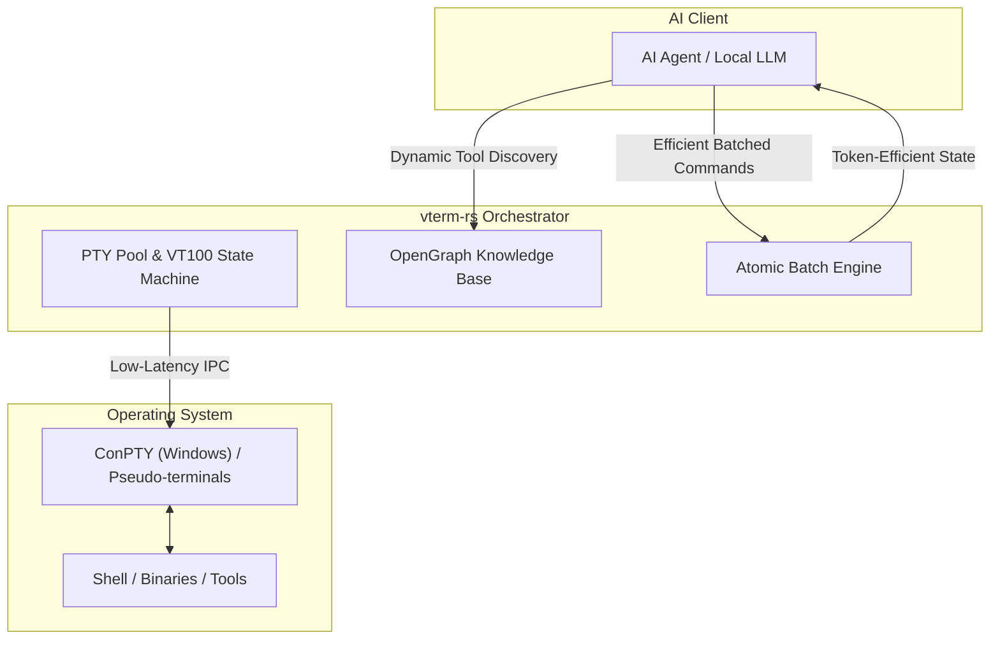

# vterm-rs [](https://cursor.com/en/install-mcp?name=vterm-rs&config=eyJjb21tYW5kIjoidXZ4IiwiaW5zdGFsbCI6InZ0ZXJtLXJzLXB5dGhvbi1tY3AiLCJhcmdzIjpbInZ0ZXJtLXJzLXB5dGhvbi1tY3AiXX0%3D)


<div align="center">

[](https://crates.io/crates/vterm-rs)
[](https://pypi.org/project/vterm-rs-python-mcp/)
[](https://github.com/margusmartsepp/vterm-rs/actions)
[](https://opensource.org/licenses/MIT)

### **High-Performance Rust PTY Orchestrator for AI Agents**
*Transforming the terminal from a blind black box into a verifiable State Machine.*

</div>

---

> [!IMPORTANT]
> **Verified Documentation**: For detailed, factual documentation of every MCP endpoint (input/output/reasoning), see the [**MCP Tool Reference**](docs/mcp/README.md).

## Key Features

| Feature | Description |
| :--- | :--- |
| **Token Efficiency** | Drastically reduces context saturation and tool-call overhead. Execute complex multi-step workflows in a single atomic batch, minimizing input/output tokens. |
| **Universal Execution** | Adds production-grade code and terminal execution capabilities to any LLM project, including local personal setups that lack a heavy application layer. |
| **Dynamic Discovery** | The **OpenGraph Architecture** endpoint allows agents to self-discover tools and capabilities, even if the orchestrator was not in their training data. |
| **Verifiable Truth** | Real-time screen grid inspection via `wait_until` and `screen_read` eliminates the "hallucination gap" in terminal automation. |
| **Zero-Latency Pool** | Near-zero startup time using pre-warmed terminal sessions and sub-millisecond pattern detection via Bloom Filters. |
| **Headless-First** | Native support for CI/CD and AI backends with a toggleable visual debug mode for human inspection. |

## Architecture



## Quick Start

### 1. One-Click Integration (Cursor)
Click the badge above or use the Cursor MCP settings to add `vterm-rs` instantly.

### 2. Manual Integration (Claude Desktop)
Add the following to your `%APPDATA%\Claude\claude_desktop_config.json`:

```json
{
  "mcpServers": {
    "vterm": {
      "command": "uvx",
      "args": ["vterm-rs-python-mcp"]
    }
  }
}
```

For a deep dive into Claude Desktop integration with step-by-step examples, see the [**Claude Integration Guide**](examples/claude/README.md).

### 3. Local Development (Rust)
```powershell
# Build the orchestrator
cargo build --release

# Start headless (production mode)
.\target\release\vterm.exe --headless

# Run integration tests
.\tests\playbook_tests.ps1 -Headless
```

## Tool Documentation & Examples

For detailed, verified examples of every tool (including JSON inputs, outputs, and reasoning for agents), please refer to the dedicated [**MCP Tool Reference**](docs/mcp/README.md).

- [**spawn**](docs/mcp/spawn.md): Spawning terminals with state verification.
- [**batch**](docs/mcp/batch.md): Token-efficient multi-step workflows.
- [**wait_until**](docs/mcp/wait_until.md): Visual synchronization.
- [**extract**](docs/mcp/extract.md): Structured data recovery.
- [**read**](docs/mcp/read.md) / [**write**](docs/mcp/write.md): Interactive terminal primitives.

### **Use Case Spotlights**
*   [**Gemini-CLI Gauntlet**](scripts/gemini_gauntlet.py): A multi-turn automated stress test for LLM terminal control.
*   [**Token-Efficient Builds**](examples/batch_efficiency.py): Demonstration of parallel compilation with zero context overhead.

---

## Ecosystem & SDKs

### Python SDK (FastMCP)
Build custom MCP servers or automate terminals using blazing-fast PyO3 bindings.

```bash
pip install vterm-rs-python-mcp
```

```python
import vterm_python
client = vterm_python.VTermClient()

# Atomic "Fluent Fleet" operation: saves tokens by batching logic
res = client.batch([
    client.spawn_op("build", max_lines=500),
    client.write_op(1, "cargo build<Enter>"),
    client.wait_until_op(1, "Finished", timeout_ms=30000)
])
```

### Native Rust Bridge
For maximum performance, use the native Rust MCP binary directly. It includes advanced tools like `rust_eval` (using [evcxr](https://github.com/evcxr/evcxr)) and the architecture discovery endpoint.

```bash
cargo run --release --bin vterm-mcp
```

## Project Status

| Area | Status | Target |
| :--- | :--- | :--- |
| **Windows + ConPTY** | Stable | v0.7.0 |
| **Python SDK** | Stable (v0.7.20) | v0.7.0 |
| **Linux / macOS** | In Progress | v0.8.0 |
| **Wire Protocol** | Unstable | v1.0.0 |
| **Test Coverage** | Improving | Ongoing |

---

## License
MIT License. See [AGENTS.md](AGENTS.md) for contribution guidelines and project invariants.

---
