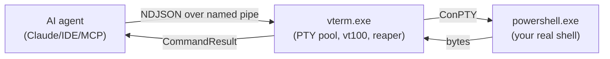

# vterm-rs

[](https://crates.io/crates/vterm-rs)
[](https://pypi.org/project/vterm-rs-python-mcp/)
[](https://github.com/margusmartsepp/vterm-rs/actions)
[](https://cursor.com/en/install-mcp?name=vterm-rs&config=eyJjb21tYW5kIjoidXZ4IiwiaW5zdGFsbCI6InZ0ZXJtLXJzLXB5dGhvbi1tY3AiLCJhcmdzIjpbInZ0ZXJtLXJzLXB5dGhvbi1tY3AiXX0%3D)

> **The High-Performance Rust PTY Orchestrator for AI Agents.**

`vterm-rs` is a state-aware terminal host built specifically for AI agents (and the humans who build them). It transforms the terminal from a "blind black box" into a **State Machine** that agents can inspect, reason about, and control fluently.

## Why vterm-rs?

*   **Safety (Guardrails)**: Prevent "Infinite Log Floods" with `max_lines` and `max_duration` limits.
*   **Truth (State Machine)**: Don't guess if a command finished. Use `wait_until` and `screen_read` to inspect the visual grid.
*   **Fluent Fleet**: Orchestrate multiple terminals atomically with the high-performance `batch()` API.
*   **Headless-First**: Designed for CI/CD and AI backends, with optional `--visible` mode for debugging.

## Quick Start (Python SDK)

```python
import vterm_python

client = vterm_python.VTermClient()

# The "Fluent Fleet" way: Atomically set up your session
ops = [
    client.spawn_op("Build", visible=True),
    client.write_op(1, "cargo build<Enter>"),
    client.wait_until_op(1, "Finished", timeout_ms=30000)
]

result = client.batch(ops)
print(f"Build status: {result['sub_results'][2]['status']}")
```




## Why

Existing tools either capture command output (no interactivity, no signals, no TUI) or
embed a shell as a library (no real PTY semantics, no parity with what a user sees).
`vterm-rs` is neither — it's the actual terminal, scriptable.

What you can do that you couldn't before:

- Tell an agent *"the build is hung, send Ctrl-C and try again"* and have it work.
- Have an agent exit `vim` for you. `:wq`, problem solved.
- Boot a microservice fleet — Redis, Postgres, three services, one log-tailer — in
  one command. Reap the whole tree with one disconnect.
- Run the same playbook headlessly in CI that you ran with visible windows locally.

## Quickstart

```powershell
# 1. Build
cargo build --release

# 2. Start the orchestrator (visible windows by default)
.\target\release\vterm.exe

# 2. Or start it headless, no windows ever appear
.\target\release\vterm.exe --headless

# 3. From another shell, drive it
.\tests\playbook_tests.ps1 -Headless
```

## The protocol in 30 seconds

Every line on the pipe is one JSON command. Every command produces exactly one response.
Both sides may include a `req_id` for correlation.

```json
// → request
{"req_id": 7, "type": "Spawn", "payload": {"title": "build", "visible": false}}

// ← response
{"req_id": 7, "status": "success", "duration_ms": 11, "id": 1}
```

Composite work uses `Batch`, which returns one aggregate response, not N+1 lines:

```json
// → request
{"req_id": 8, "type": "Batch", "payload": {"commands": [
  {"type": "ScreenWrite", "payload": {"id": 1, "text": "cargo build<Enter>"}},
  {"type": "WaitUntil",   "payload": {"id": 1, "pattern": "Compiling", "timeout_ms": 30000}},
  {"type": "ScreenRead",  "payload": {"id": 1}}
]}}

// ← response
{"req_id": 8, "status": "success", "duration_ms": 1247, "sub_results": [ … ]}
```

Full spec: [`docs/protocol.md`](docs/protocol.md).

## Three ways to consume it

1. **Python SDK & FastMCP Bridge (New!)**
   Build custom MCP servers or automate terminal operations using the blazing fast Python PyO3 bindings.
   
   ```bash
   pip install vterm-rs-python-mcp
   ```

   ```python
   import vterm_python
   from fastmcp import FastMCP
   
   mcp = FastMCP("vterm")
   client = vterm_python.VTermClient()
   
   @mcp.tool()
   def run_build() -> str:
       # Using the new atomic batch API
       ops = [
           client.spawn_op("build", max_lines=500),
           client.write_op(1, "cargo build<Enter>"),
           client.wait_until_op(1, "Finished", timeout_ms=30000)
       ]
       res = client.batch(ops)
       return "Build triggered" if res["status"] == "success" else "Error"
   ```

2. **Direct MCP Server (Plug-and-Play)**
   Use it directly in your AI client (like Claude Desktop) without writing code.

   ```json
   {
     "mcpServers": {
       "vterm": {
         "command": "vterm-mcp"
       }
     }
   }
   ```

3. **Rust Native MCP Server**
   For maximum performance, use the native Rust MCP binary.
   ```bash
   cargo run --bin vterm-mcp
   ```

**Examples**: Explore the [examples/python_sdk](examples/python_sdk) directory for typical DevOps and CI use cases.

**Tests**: To run the Python tests locally, navigate to `vterm-python` and run `uv run maturin develop`, followed by `uv run ../tests/python_sdk/test_mcp.py`.

4. **Raw pipe.**
   Connect, write JSON, read JSON. The PowerShell harness in [`tests/playbook_tests.ps1`](tests/playbook_tests.ps1) is the canonical example.

5. **Skill manifest.**
   [`skill.toml`](skill.toml) declares each command as an AI skill — useful for non-MCP agents.

## Project structure

See [`AGENTS.md`](AGENTS.md) for the layout, code style, and invariants you must respect
when editing.

## Status

| Area              | State                                                  |
| ----------------- | ------------------------------------------------------ |
| Windows + ConPTY  | works                                                  |
| Python Bridge     | works (v0.7.10, available via PyPI `vterm-rs-python-mcp`) |
| Linux / macOS     | planned (v0.8.0)                                       |
| Wire protocol     | unstable, will be pinned at v1.0                       |
| Test coverage     | smoke (PowerShell) + Rust integration + Python FastMCP |

## License

MIT
