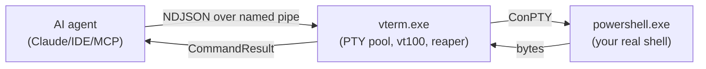

# vterm-rs

> A Rust PTY orchestrator for AI agents. One long-lived process owns a pool of real
> terminals; clients drive them through a single named pipe with newline-delimited JSON.

`vterm-rs` is the missing primitive between *"AI generates a command"* and *"command runs in
my actual shell"*. It does not capture stdout, it does not sandbox — it owns a real
ConPTY, parses it through `vt100`, and lets you write keystrokes (including `Ctrl-C`,
`<Up>`, `<Tab>`, raw escape sequences) and read what the screen actually shows.

```
┌─ AI agent ───┐   NDJSON over    ┌─ vterm.exe ───┐   ConPTY    ┌─ powershell.exe ─┐
│  Claude /    │  named pipe      │  PTY pool     │             │   your real      │
│  IDE / MCP   │ ───────────────▶ │  vt100 parser │ ──────────▶ │    shell         │
│  client      │ ◀─────────────── │  reaper       │ ◀────────── │                  │
└──────────────┘  CommandResult   └───────────────┘  bytes      └──────────────────┘


```

## Why

Existing tools either capture command output (no interactivity, no signals, no TUI) or
embed a shell as a library (no real PTY semantics, no parity with what a user sees).
`vterm-rs` is neither — it's the actual terminal, scriptable.

What you can do that you couldn't before:

- Tell an agent *"the build is hung, send Ctrl-C and try again"* and have it work.
- Have an agent exit `vim` for you. `:wq`, problem solved.
- Boot a microservice fleet — Redis, Postgres, three services, one log-tailer — in
  one command. Reap the whole tree with one disconnect.
- Run the same playbook headlessly in CI that you ran with visible windows locally.

## Quickstart

```powershell
# 1. Build
cargo build --release

# 2. Start the orchestrator (visible windows by default)
.\target\release\vterm.exe

# 2. Or start it headless, no windows ever appear
.\target\release\vterm.exe --headless

# 3. From another shell, drive it
.\tests\playbook_tests.ps1 -Headless
```

## The protocol in 30 seconds

Every line on the pipe is one JSON command. Every command produces exactly one response.
Both sides may include a `req_id` for correlation.

```json
// → request
{"req_id": 7, "type": "Spawn", "payload": {"title": "build", "visible": false}}

// ← response
{"req_id": 7, "status": "success", "duration_ms": 11, "id": 1}
```

Composite work uses `Batch`, which returns one aggregate response, not N+1 lines:

```json
// → request
{"req_id": 8, "type": "Batch", "payload": {"commands": [
  {"type": "ScreenWrite", "payload": {"id": 1, "text": "cargo build<Enter>"}},
  {"type": "WaitUntil",   "payload": {"id": 1, "pattern": "Compiling", "timeout_ms": 30000}},
  {"type": "ScreenRead",  "payload": {"id": 1}}
]}}

// ← response
{"req_id": 8, "status": "success", "duration_ms": 1247, "sub_results": [ … ]}
```

Full spec: [`docs/protocol.md`](docs/protocol.md).

## Three ways to consume it

1. **Raw pipe.** Connect, write JSON, read JSON. The PowerShell harness in
   [`tests/playbook_tests.ps1`](tests/playbook_tests.ps1) is the canonical example.
2. **Skill manifest.** [`skill.toml`](skill.toml) declares each command as an AI skill —
   useful for non-MCP agents.
3. **MCP server (planned, v0.7).** A `vterm-mcp` bridge will expose every command as an
   MCP tool callable from Claude Code / Cowork / any MCP client. See [ROADMAP.md](ROADMAP.md).

## Project structure

See [`AGENTS.md`](AGENTS.md) for the layout, code style, and invariants you must respect
when editing.

## Status

| Area              | State                                                  |
| ----------------- | ------------------------------------------------------ |
| Windows + ConPTY  | works                                                  |
| Linux / macOS     | planned (v0.8)                                         |
| MCP bridge        | planned (v0.7)                                         |
| Wire protocol     | unstable, will be pinned at v1.0                       |
| Test coverage     | smoke (PowerShell) + Rust integration (v0.6)           |

## License

TBD.
