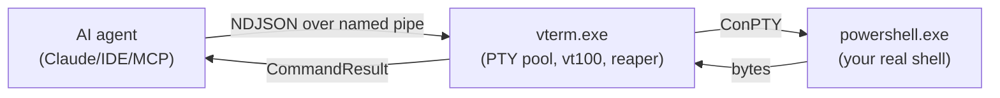

# vterm-rs

> A Rust PTY orchestrator for AI agents. One long-lived process owns a pool of real
> terminals; clients drive them through a single named pipe with newline-delimited JSON.

`vterm-rs` is the missing primitive between *"AI generates a command"* and *"command runs in
my actual shell"*. It does not capture stdout, it does not sandbox — it owns a real
ConPTY, parses it through `vt100`, and lets you write keystrokes (including `Ctrl-C`,
`<Up>`, `<Tab>`, raw escape sequences) and read what the screen actually shows.





## Why

Existing tools either capture command output (no interactivity, no signals, no TUI) or
embed a shell as a library (no real PTY semantics, no parity with what a user sees).
`vterm-rs` is neither — it's the actual terminal, scriptable.

What you can do that you couldn't before:

- Tell an agent *"the build is hung, send Ctrl-C and try again"* and have it work.
- Have an agent exit `vim` for you. `:wq`, problem solved.
- Boot a microservice fleet — Redis, Postgres, three services, one log-tailer — in
  one command. Reap the whole tree with one disconnect.
- Run the same playbook headlessly in CI that you ran with visible windows locally.

## Quickstart

```powershell
# 1. Build
cargo build --release

# 2. Start the orchestrator (visible windows by default)
.\target\release\vterm.exe

# 2. Or start it headless, no windows ever appear
.\target\release\vterm.exe --headless

# 3. From another shell, drive it
.\tests\playbook_tests.ps1 -Headless
```

## The protocol in 30 seconds

Every line on the pipe is one JSON command. Every command produces exactly one response.
Both sides may include a `req_id` for correlation.

```json
// → request
{"req_id": 7, "type": "Spawn", "payload": {"title": "build", "visible": false}}

// ← response
{"req_id": 7, "status": "success", "duration_ms": 11, "id": 1}
```

Composite work uses `Batch`, which returns one aggregate response, not N+1 lines:

```json
// → request
{"req_id": 8, "type": "Batch", "payload": {"commands": [
  {"type": "ScreenWrite", "payload": {"id": 1, "text": "cargo build<Enter>"}},
  {"type": "WaitUntil",   "payload": {"id": 1, "pattern": "Compiling", "timeout_ms": 30000}},
  {"type": "ScreenRead",  "payload": {"id": 1}}
]}}

// ← response
{"req_id": 8, "status": "success", "duration_ms": 1247, "sub_results": [ … ]}
```

Full spec: [`docs/protocol.md`](docs/protocol.md).

## Three ways to consume it

1. **Python SDK & FastMCP Bridge (New!)**
   Build custom MCP servers or automate terminal operations using the blazing fast Python PyO3 bindings.
   
   ```bash
   # Modern python devs use uv
   uv add vterm-rs-python-mcp
   
   # Or standard pip
   pip install vterm-rs-python-mcp
   ```

   ```python
   import vterm_python
   from fastmcp import FastMCP
   
   mcp = FastMCP("vterm")
   client = vterm_python.VTermClient()
   
   @mcp.tool()
   def run_build() -> str:
       tid = client.spawn("build", None, 5000, 500)
       client.write(tid, "cargo build\n")
       res = client.wait_until(tid, r"Finished `dev` profile", 30000)
       client.close(tid)
       return res
   
   if __name__ == "__main__":
       mcp.run()
   ```
   **Examples**: Explore the [examples/python_sdk](examples/python_sdk) directory for typical DevOps and CI use cases.
   **Tests**: To run the Python tests locally, navigate to `vterm-python` and run `uv run maturin develop`, followed by `uv run ../tests/python_sdk/test_mcp.py`.

2. **Raw pipe.** Connect, write JSON, read JSON. The PowerShell harness in
   [`tests/playbook_tests.ps1`](tests/playbook_tests.ps1) is the canonical example.
3. **Skill manifest.** [`skill.toml`](skill.toml) declares each command as an AI skill —
   useful for non-MCP agents.

## Project structure

See [`AGENTS.md`](AGENTS.md) for the layout, code style, and invariants you must respect
when editing.

## Status

| Area              | State                                                  |
| ----------------- | ------------------------------------------------------ |
| Windows + ConPTY  | works                                                  |
| Python Bridge     | works (v0.7.7, available via PyPI `vterm-rs-python-mcp`) |
| Linux / macOS     | planned (v0.8.0)                                       |
| Wire protocol     | unstable, will be pinned at v1.0                       |
| Test coverage     | smoke (PowerShell) + Rust integration + Python FastMCP |

## License

MIT
