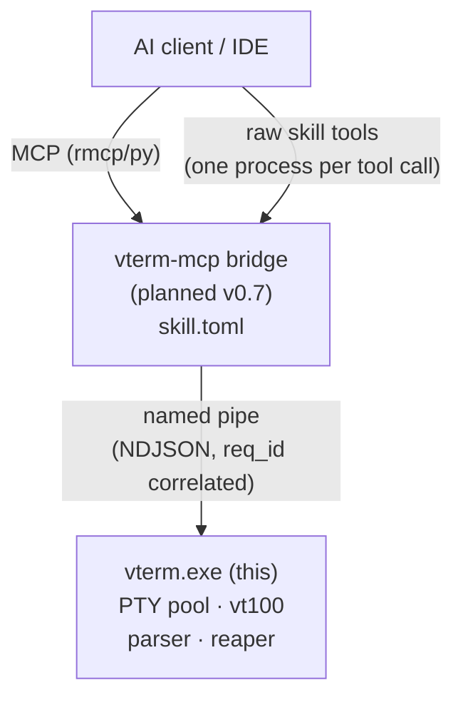

# Roadmap

## North star

> A developer should never lose ten minutes to remembering the keystroke that exits vim,
> never lose an hour booting a half-dozen microservices by hand, and never lose a day
> figuring out why a script hung in CI but passed locally.
>
> An AI agent should be able to *drive a real terminal* — keystrokes, signals, screen
> reads — through a single fast, deterministic, OS-level interface. Not a sandboxed
> shim. Not a captured stdout. The actual terminal.

`vterm-rs` is that interface.

## Personas

| Persona             | What they want                                                          |
| ------------------- | ----------------------------------------------------------------------- |
| Principal engineer  | Boot a microservice fleet with one command, kill it as fast.            |
| AI agent            | Send `Ctrl-C`, exit `vim`, navigate menus, read what the screen shows.  |
| CI pipeline         | Run the same playbook headlessly that ran visibly on the developer box. |
| Curious tool author | Write skills/MCP tools without owning a PTY parser.                     |

## Consumption surfaces

```
                ┌──────────────────────┐
                │   AI client / IDE    │
                └──┬─────────┬─────────┘
                   │         │
            MCP    │         │  raw skill tools
        (rmcp/py)  │         │  (one process per tool call)
                   ▼         ▼
            ┌──────────────────────┐
            │   vterm-mcp bridge   │  (planned v0.7)
            │     skill.toml       │
            └──────────┬───────────┘
                       │  named pipe (NDJSON, req_id correlated)
                       ▼
            ┌──────────────────────┐
            │   vterm.exe (this)   │
            │  PTY pool · vt100    │
            │  parser · reaper     │
            └──────────────────────┘
```



## Milestones

### v0.6 — *foundations* (this release)

Status: **completed**.

- [x] Documentation suite (`AGENTS.md`, `ROADMAP.md`, `docs/`)
- [x] Crate restructured into `lib.rs` + modules
- [x] Correlation IDs, atomic batch responses, reliable error envelopes
- [x] Tower-style command pipeline (timing, tracing, correlation as layers)
- [x] Per-connection ownership + RAII reaping
- [x] PID→HWND deterministic window control
- [x] Prompt-aware initial command (no more `sleep(2000)`)
- [x] `--headless` orchestrator flag
- [x] PowerShell smoke harness rewritten around real use cases
      (Ctrl-C interruption, vim exit, multi-service spawn)
- [x] Rust integration tests for the protocol

Exit criteria: `cargo test` green, smoke harness green in both visible and headless modes,
no `cargo clippy -- -D warnings` errors.

### v0.7 — *MCP bridge*

Status: **completed**.

- [x] `vterm-mcp` binary built on [`rmcp`](https://crates.io/crates/rmcp), exposing every `SkillCommand` as an MCP tool
- [x] `skill.toml` regenerated to point at the bridge
- [x] Streaming `screen_read` over MCP `notifications/progress`
- [x] Reference Cowork plugin manifest

### v0.7.12 — *State-Aware Orchestration* (this release)

Status: **completed**.

- [x] **PyO3 High-Performance Bridge**: Blazing fast Python SDK (`vterm-rs-python-mcp`)
- [x] **Atomic Batch API**: Orchestrate fleets of terminals in a single round-trip
- [x] **Operator Methods**: Fluent `_op` syntax for clean, typed batch construction
- [x] **Plug-and-Play MCP Server**: Built-in server for Cursor/Claude Desktop integration
- [x] **Graphify Integration**: Automatic architectural mapping and knowledge graph sync

Exit criteria: An AI agent can drive a complex TUI (Claude Code), reason about visual states, and manage multiple sessions with near-zero latency.

### v0.8 — *cross-platform foundations*

Status: **in progress**.

- [ ] **PTY Abstraction**: Replace ConPTY with `portable-pty` for Linux/macOS support
- [ ] **UDS Transport**: Unix Domain Sockets mirroring the named-pipe semantics
- [ ] **General Window Traits**: Abstract `WindowHandle` for X11/Wayland/Quartz
- [ ] **CI Matrix**: windows-latest, ubuntu-latest, macos-latest

Exit criteria: the same "Fluent Fleet" playbook runs on all three OSes with no script changes.

### v0.9 — *observability + replay*

Status: **planned**.

- [ ] Per-terminal `tracing` JSON log fan-out
- [ ] Asciinema-compatible session recording, replayable through the orchestrator
- [ ] `vterm replay <file>` for deterministic CI reproduction

### v1.0 — *production*

Status: **planned**.

- [ ] Stable wire protocol, version negotiation pinned to v1
- [ ] Crates.io publish of `vterm-core` (the library)
- [ ] Signed Windows binary, brew tap, .deb
- [ ] First-class GitHub Action

## Bench

Things to measure as we go:

- Cold-start latency (orchestrator launch → first `Ready` response)
- Per-command round-trip (1 PTY, idle)
- 50 concurrent `WaitUntil` polls — runtime stays under 5% CPU
- Reaping correctness — kill 100 PTYs, verify `tasklist | findstr powershell` is clean

## Non-goals

- Replacing `tmux`/`screen`. We're a *programmable* host, not a multiplexer UI.
- Embedding a TUI library. The agent reads the screen; UI lives in the agent.
- Sandboxing the spawned shell. Trust boundary is the named pipe ACL.
