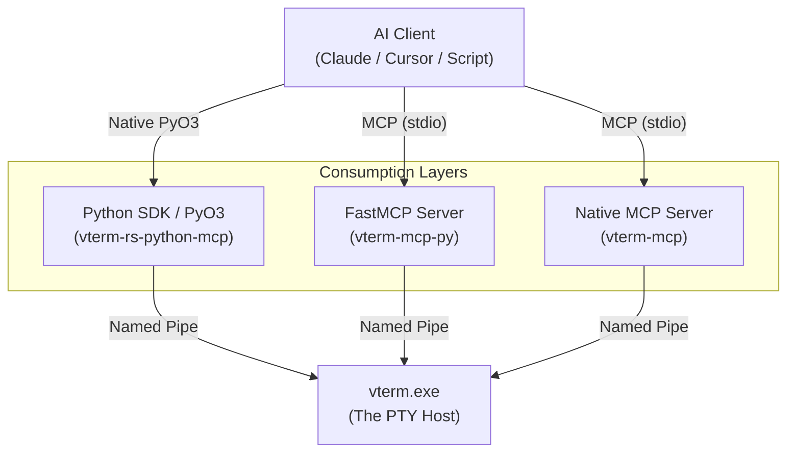
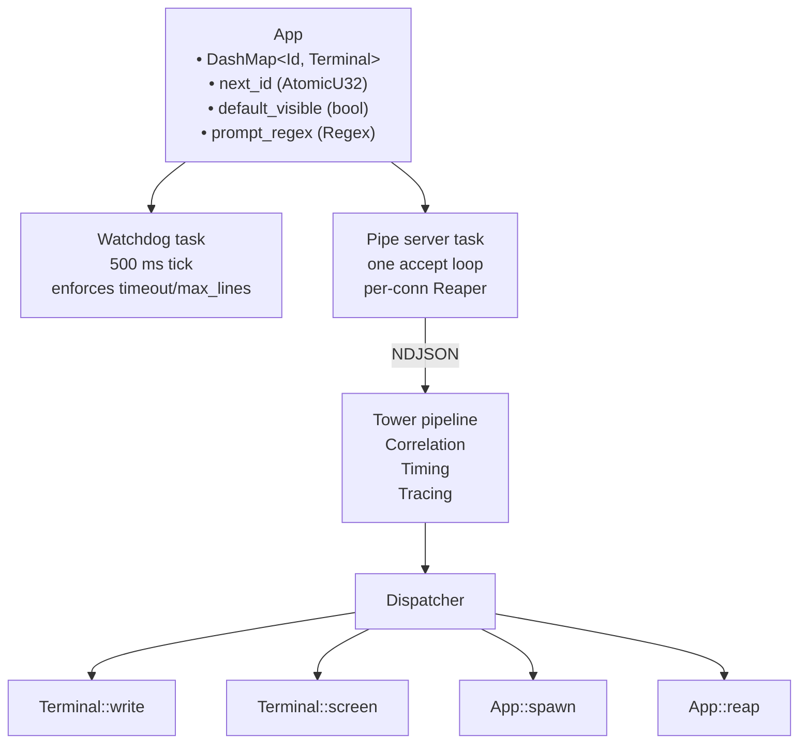
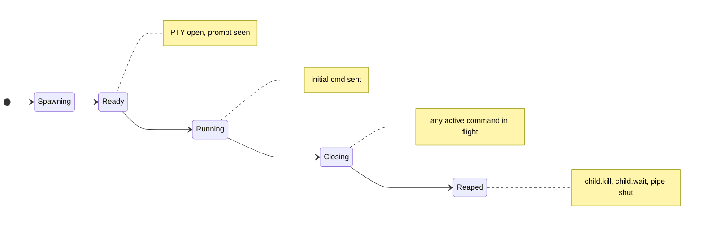
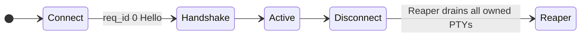
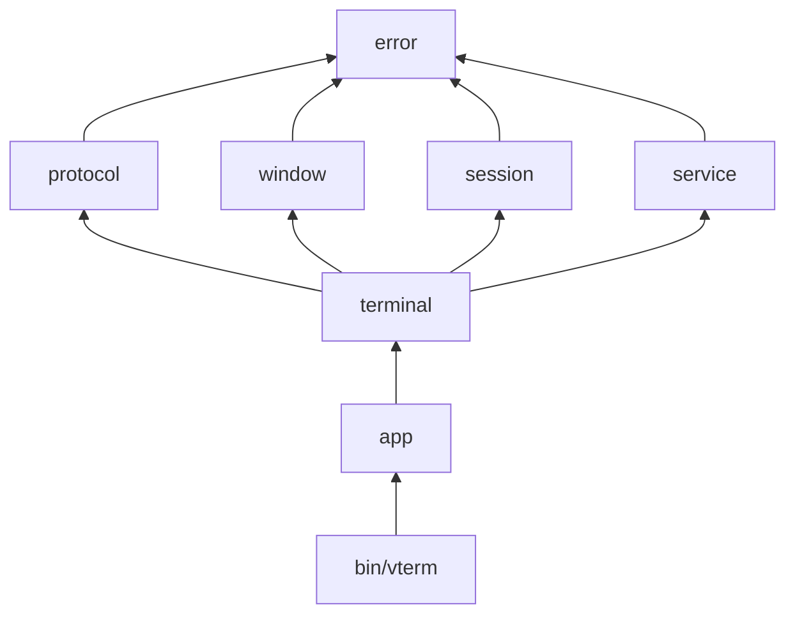

# Architecture

## Components at a glance

`vterm-rs` is a tiered system. The core Rust orchestrator manages the PTYs and parses the screen grid, while various bridge layers expose this power to AI agents.

## Internal Rust Architecture

## Lifecycles

### Terminal (type-state)

Each transition is encoded in the type system inside `terminal::instance` so that, for
example, a `Terminal<Spawning>` cannot be passed to `ScreenRead` — the program won't
compile.

### Connection

The Reaper is a `Drop` impl on the per-connection guard, so reaping happens whether the
client disconnected cleanly or panicked.

## Concurrency model

- One tokio multi-threaded runtime (`flavor = "multi_thread"`).
- One pipe-server task accepts connections sequentially (single-instance pipe).
- Per connection: one read loop + one write Mutex (`tokio::sync::Mutex<WriteHalf>`).
- Per terminal: one PTY-pump thread (`spawn_blocking`) → mpsc → optional client viewer.
- `vt100::Parser` and the PTY writer are guarded by `parking_lot::Mutex` —
  always-short critical sections, never held across `.await`.

## Why these choices

| Choice                         | Why                                                                 |
| ------------------------------ | ------------------------------------------------------------------- |
| `tower::Service` for dispatch  | Aspects (timing, tracing, correlation) compose without forking      |
| `parking_lot::Mutex`           | No poisoning, faster than `std`, fine for short critical sections   |
| `tokio::sync::Mutex<WriteHalf>`| The only Mutex held across `.await` (inside the writer)             |
| `OnceLock<Regex>`              | One-time compilation, no `lazy_static` macro                        |
| `bon::Builder` on `Spawn`      | Long argument lists become fluent and self-documenting              |
| Type-state on `Terminal<S>`    | Compile-time impossibility of "read before ready"                   |
| Single-instance pipe           | Eliminates the multi-orchestrator confusion that bit us in v0.5     |
| Per-connection ownership       | Closes the zombie-PTY class of bugs                                 |

## Module dependency graph

