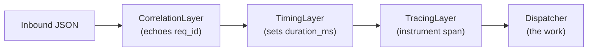

# v0.6 — foundations

The v0.6 release pays down the technical debt of the v0.3–v0.5 era. It also crystallises
the documentation and module layout we'll build on for the MCP bridge (v0.7) and
cross-platform support (v0.8).

## Headline changes

### Crate restructured into a library + binary

Everything that isn't I/O at the edges now lives in `src/lib.rs` and reusable modules:
`protocol`, `terminal`, `window`, `session`, `service`, `app`, `error`. The `vterm.exe`
binary in `src/bin/vterm.rs` is a thin shell over the library — which means
`tests/protocol.rs` can exercise the wire types without spinning up a PTY.

### Tower-style command pipeline

Command handling is no longer a god-`match` inside a god-`async fn`. Instead, every
command flows through a `tower::Service` stack:

```text
Inbound JSON  ─►  CorrelationLayer  ─►  TimingLayer  ─►  TracingLayer  ─►  Dispatcher
                  (echoes req_id)       (sets duration_ms) (instrument span)  (the work)
```



Adding a new aspect (rate limiting, auth, retries) is one new `Layer` impl, not a
surgery on `handle_command`.

### Singleton orchestrator, real ownership

- Server uses `first_pipe_instance(true)` — a second `vterm.exe` fails fast with a clear
  message instead of silently shadowing the first.
- Each connection gets a `ConnectionId` and *owns* the terminals it spawns. When the
  connection drops, a `Reaper` task kills the children and removes them from the map.
  No more zombie `powershell.exe`.

### Window control is now deterministic

Spawned process PIDs are tracked. `screen_control` uses `EnumWindows` +
`GetWindowThreadProcessId` to resolve the exact HWND. Custom shell prompts and `cd`
commands no longer break window operations.

### Prompt-aware initialisation

Initial commands wait for the prompt regex (`PS .*> $` by default) instead of sleeping.
Cuts cold-start time from a flat 2000 ms to typically <300 ms.

### `--headless` orchestrator flag

```powershell
vterm.exe --headless         # default visibility: hidden
vterm.exe --visible          # default visibility: visible (this is the default)
vterm.exe --prompt-regex '~$' # override the prompt detector
```

`Spawn { visible: ... }` and `Batch { visible: ... }` continue to override per-command.

### Test harness rewritten around real use cases

The PowerShell smoke harness no longer waits for ping packets. It demonstrates:

1. **Ctrl-C interruption.** Start `ping -t google.com`, send `<C-c>`, verify the
   process stopped and the prompt returned.
2. **Vim exit.** Open `vim`, send `<Esc>:q!<Enter>`, verify back at prompt.
3. **Multi-service spawn + reap.** Spawn three terminals, confirm `List` returns three
   IDs, disconnect, confirm orchestrator reaped them.

## Wire format changes

| What                 | Before                                           | After                                          |
| -------------------- | ------------------------------------------------ | ---------------------------------------------- |
| Per-request id       | none                                             | optional `req_id: u64`, echoed                 |
| `Batch` responses    | N+1 lines (sub-responses then summary)           | exactly one line with `sub_results: [...]`    |
| Aggregate status     | always `"success"` unless `stop_on_error` fired  | `"error"` if any sub failed, regardless        |
| Parse failure        | silently dropped                                 | `{"status":"error","error":"parse: ..."}`      |
| Prompt detection     | `sleep(2000)`                                    | `WaitUntil` against configurable prompt regex  |

## Migration

Clients that did positional response counting (`for $i = 0..N { Read-Response }`) will
need to migrate to one read per request. `req_id` makes this trivially safe.

The PowerShell harness was rewritten in this release; use it as a reference.

## Status

- Windows: works.
- Linux/macOS: not in scope for v0.6.
- MCP bridge: not in scope for v0.6 — see [ROADMAP.md](../../ROADMAP.md).
