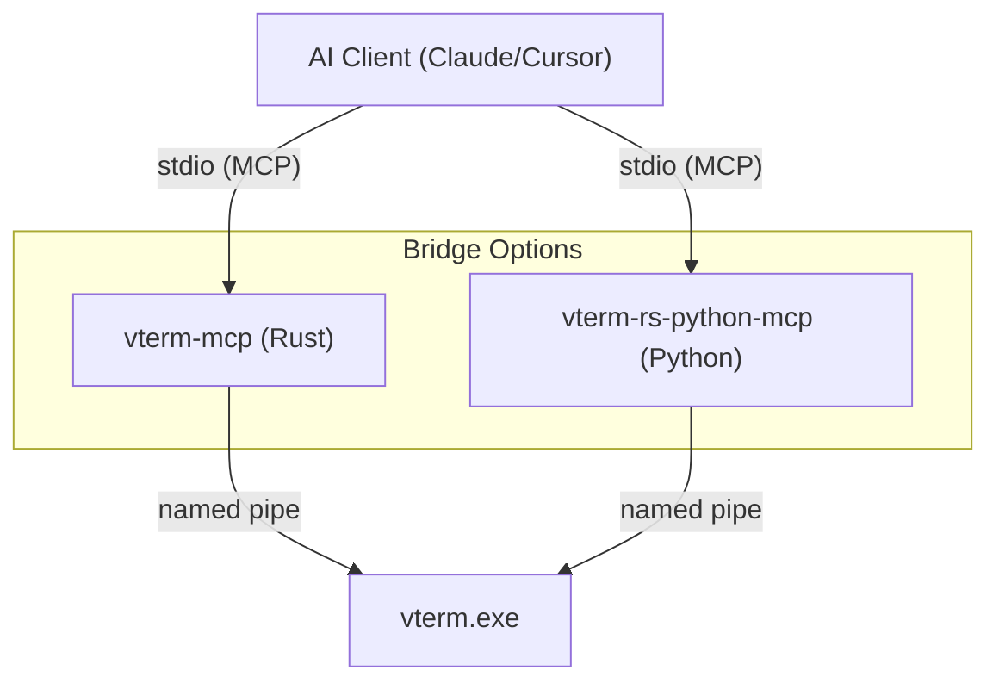

# MCP Bridge

The Model Context Protocol (MCP) Bridge allows any MCP-compliant AI client (such as Claude Desktop, Cursor, or Cowork) to interact natively with the `vterm-rs` orchestrator. We provide two implementations:

1.  **Rust Native (`vterm-mcp`)**: Built for maximum performance and minimum binary size.
2.  **Python / FastMCP (`vterm-rs-python-mcp`)**: Built for ease of installation and "one-click" IDE integration via PyPI.

## Architecture

Regardless of the implementation, the bridge acts as an adapter, translating standardized MCP tool calls into JSON-RPC messages sent over the orchestrator's named pipe.



### Auto-Spawning

Both bridges provide a zero-configuration experience. When launched by an AI client, they automatically attempt to connect to the orchestrator pipe. If the orchestrator is not running, the bridge will spawn it invisibly in the background (`--headless`) and retry the connection.

### Connection Reaping

The bridge holds a long-lived multiplexed connection to the orchestrator. Because `vterm-rs` binds terminal lifecycles to the pipe connection, if the AI client drops the stdio stream (e.g., when the session is closed), the bridge process exits, and the orchestrator instantly reaps all child processes (like `powershell.exe`) spawned during that session.

## Exposed Tools

The bridges expose a standardized set of tools:

1.  `spawn`: Spawns a new PTY shell with optional guardrails (`max_lines`, `timeout_ms`).
2.  `write`: Writes string sequences to the shell (handles keystrokes and shortcuts like `<Enter>`).
3.  `read`: Reads the current visual grid (snapshot) of the screen buffer.
4.  `wait_until`: Blocks until a regex pattern appears on the screen. **Streams live progress updates back to the AI client.**
5.  `batch`: Executes an atomic sequence of commands with near-zero latency.
6.  `close`: Safely terminates the specified PTY session.

## Configuration

### Option A: Python (Recommended for most users)

The easiest way to use the bridge is via `uvx` (from the `uv` tool).

**Claude Desktop Configuration:**
```json
{
  "mcpServers": {
    "vterm": {
      "command": "uvx",
      "args": ["vterm-rs-python-mcp"]
    }
  }
}
```

### Option B: Rust Native (Best performance)

Use this if you prefer a standalone binary with no Python dependency.

**Claude Desktop Configuration:**
```json
{
  "mcpServers": {
    "vterm-rs": {
      "command": "cargo",
      "args": ["run", "--release", "--bin", "vterm-mcp"]
    }
  }
}
```

> **Note**: For production deployments, replace the `cargo run` command with the absolute path to your compiled `vterm-mcp.exe`.
